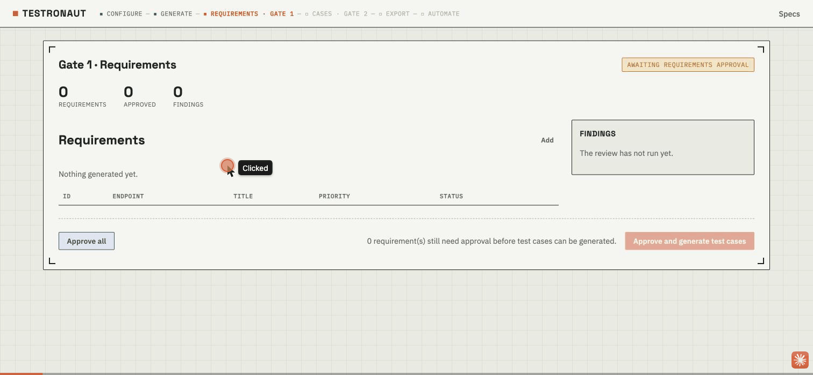

# Testronaut

AI-driven test case generation from OpenAPI specs, with a human in the loop
twice. Spec → functional requirements → **you approve** → test cases → **you
approve** → export to JSON or Excel.

The two approval gates are the point. Splitting "what must the API do" from "how
do we test it" means a wrong assumption costs one line to fix at the requirements
stage instead of fifteen test cases later, and every case is traceable to the
requirement it exercises.

Single-user local tool. No login, no cloud, no telemetry. Runs against a local
Ollama model by default, so a full run costs nothing and needs no API key.



▶ [Watch with voiceover](docs/assets/demo.mp4) (mp4, narrated)

## Requirements

- Python 3.12–3.14
- Node 18+
- [Ollama](https://ollama.com) with a model pulled (`ollama pull qwen2.5:14b`),
  or an `OPENAI_API_KEY` / `ANTHROPIC_API_KEY`
- Docker, to execute generated tests and for the Docker Compose setup below.
  Optional — without it you can still generate and download the project and
  run `mvn test` yourself.

## Installation

### Option A — Docker Compose (fastest)

```bash
git clone https://github.com/tusharranjan-ai/testronaut.git
cd testronaut

cp .env.example .env        # optional; every value has a default
docker compose up --build
```

Frontend: http://localhost:8080. Backend: http://localhost:8000. Ollama on the
host is reached automatically via `host.docker.internal`.

### Option B — Run locally

```bash
git clone https://github.com/tusharranjan-ai/testronaut.git
cd testronaut

# Backend
python3 -m venv .venv
.venv/bin/pip install -r backend/requirements.txt

# Frontend
cd frontend && npm install && cd ..

# Config (optional; every value has a default)
cp .env.example .env
```

Start both in separate terminals:

```bash
.venv/bin/uvicorn backend.main:app --reload --port 8000
```

```bash
cd frontend && npm run dev
```

Open http://localhost:5173. Vite proxies `/api` to port 8000, so no CORS setup
is needed for local use.

## Using it

1. **Upload a spec** — an OpenAPI 3.x document by file or URL. Swagger 2.0 is
   rejected with a message telling you to convert it.
   `examples/petstore-mini.json` is a five-endpoint spec to try it on.
2. **Configure the run** — provider, model, which coverage categories
   (happy path, negative, boundary, auth, security), and which endpoints.
3. **Gate 1 — requirements.** One LLM call per endpoint drafts requirements; a
   second critic call reviews them against the spec and applies mechanical
   corrections in exactly one pass. Every applied change shows before → after
   and can be reverted individually. Edit, add, delete, then approve.
   Nothing generates test cases until you do.
4. **Gate 2 — test cases.** Generated from the approved requirements plus the
   spec, reviewed the same way. A coverage panel shows, computed in Python and
   not by a model, which requirements are uncovered, which cases are orphans,
   and which endpoints produced nothing.
5. **Export.** JSON round-trips exactly. Excel is for reviewers who would rather
   edit a spreadsheet — edit it, import it back, and the requirement links
   survive. A malformed cell is reported as a row error; the rest still imports.
6. **Automation.** Approved cases become a Maven project using TestNG and REST
   Assured. Give it the base URL of the system under test and any credentials,
   then run it — in a container, never on your machine. Results come back joined
   to the case IDs they came from.

## Tests

```bash
.venv/bin/pytest
```

Covers the parts that actually break: `$ref` resolution including circular
schemas, the validation rules, export/import fidelity through both formats,
traceability, the full two-gate pipeline against a stubbed model, the assertion
grammar, the generated Java, and Surefire report parsing.

## Configuration

See `.env.example`. Every value has a working default; the file is only needed
for API keys.

## How it works

```
spec ─▶ parse ─▶ ┌─ STAGE 1 ────────────────┐
                 │ generate requirements    │  1 LLM call per endpoint
                 │ critic review            │  1 LLM call per endpoint
                 │ one bounded revision     │
                 └───────────┬──────────────┘
                       ╔═════▼═════╗
                       ║  GATE 1   ║  you edit and approve
                       ╚═════╤═════╝
                 ┌───────────▼──────────────┐
                 │ STAGE 2                  │
                 │ generate test cases      │
                 │ critic review            │
                 │ traceability (in Python) │
                 └───────────┬──────────────┘
                       ╔═════▼═════╗
                       ║  GATE 2   ║  you edit and approve
                       ╚═════╤═════╝
                 ┌───────────▼──────────────┐
                 │ export JSON / Excel      │
                 │ codegen: Maven + TestNG  │
                 │ run in a container       │
                 │ results, per case        │
                 └──────────────────────────┘
```

Methodology for each stage lives in `.claude/skills/*/SKILL.md` — plain Markdown,
versioned and reviewable in a PR, loaded as the system prompt. Changing how
requirements are written is a Markdown edit, not a code change.

A generated artifact is rejected before it is stored if its ID is malformed or
duplicated within the run, its category was not requested, or its
`expected_status` is a code the spec never declares for that operation. The same
validators back the Agent SDK path's `PreToolUse` hook, so both transports
enforce identical rules.

Design documents: [PLAN](docs/PLAN.md), [HLD](docs/HLD.md), [LLD](docs/LLD.md).

## Generated tests

`expected_body` on a test case uses a small grammar, and that grammar is what
gets compiled into REST Assured matchers:

```
$.path == value            $.id == 5          $.name == 'Fluffy'
$.path != value            $.code != 500
$.path contains 'text'     $.message contains 'required'
$.path exists              $.id exists
$.path matches /regex/     $.name matches /^[A-Z]/
$.array length == N        $.tags length == 2
```

Anything outside the grammar is not dropped and does not silently pass — it is
emitted as a `// TODO assert manually:` comment next to the status-code check, so
a human can see exactly what is unverified.

Values written as `${petId}` are resolved at run time from
`src/test/resources/testronaut.properties`, overridable with `-DpetId=…`, so a
generated project can be committed without committing secrets.

Generated code runs in a container with `--cap-drop ALL`, no new privileges, and
a memory and PID ceiling. It is never run on the host: it came from a model that
read a spec you did not write.

## Not in v1

Browser/UI testing, multi-user auth, cloud hosting. The approved-case JSON schema
is language-agnostic, so a pytest or Playwright generator is a sibling of
`backend/codegen.py`, not a change to the data model.
